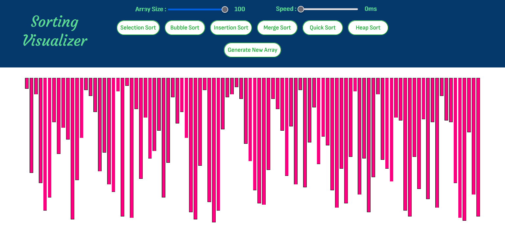
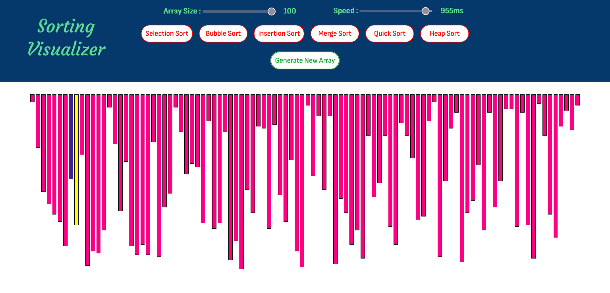

  

 

**_Sorting Visualizer is a Javascript based web app for visualizing a bunch of different sorting algorithms like :_**
1. Selection Sort
2. Bubble Sort
3. Insertion Sort
4. Merge Sort
5. Quick Sort
6. Heap Sort

_It also has the functionality of_ **_Processing Speed Control_**  _and_   **_Array Size Control_**.

 

## ScreenShots 
------------------

